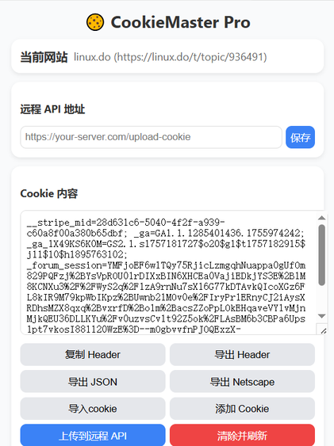
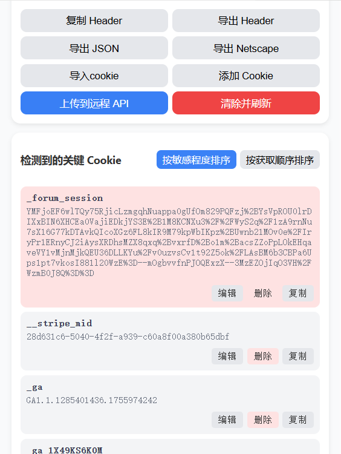

# CookieMaster Pro 🍪

一款简单而强大的 Cookie 编辑器，可快速获取、查看和导出当前域名下的所有 Cookie。支持导出为多种格式（Header String、JSON、Netscape），可直接推送到远程 API，并允许在不离开当前标签页的情况下快速创建、编辑或删除 Cookie。完美提升 Cookie 管理效率，让开发与调试更加直观便捷。

## 🌟 主要特性

- **Cookie 获取**: 自动获取当前网站及其相关域名的所有 Cookie
- **多种导出格式**: 支持导出为 Header String、JSON 和 Netscape 格式
- **远程推送**: 可将 Cookie 数据直接推送到指定的远程 API
- **Cookie 管理**: 支持创建、编辑和删除 Cookie
- **敏感识别**: 自动识别并高亮显示敏感 Cookie（如 session、token 等）
- **导入功能**: 支持从文本或文件导入 Cookie
- **实时同步**: Cookie 变化时自动刷新显示

## 📦 安装方法

### 从 Chrome Web Store 安装（推荐）

1. 访问 [Chrome 网上应用店]()
2. 搜索 "CookieMaster Pro"
3. 点击 "添加至 Chrome" 按钮

### 本地安装（开发者模式）

1. 克隆或下载本仓库
2. 打开 Chrome 浏览器，访问 `chrome://extensions/`
3. 开启右上角的"开发者模式"
4. 点击"加载已解压的扩展程序"
5. 选择本项目文件夹

## 🚀 使用说明

1. 点击浏览器工具栏中的 CookieMaster Pro 图标
2. 扩展会自动加载当前网站的 Cookie 信息
3. 使用以下功能：
   - **复制 Header**: 复制所有 Cookie 为 Header 格式
   - **导出**: 选择不同格式导出 Cookie 数据
   - **上传到远程 API**: 将 Cookie 数据发送到指定 API
   - **添加 Cookie**: 创建新的 Cookie
   - **导入 Cookie**: 从文本或文件导入 Cookie
   - **编辑/删除**: 点击 Cookie 项可进行编辑或删除操作

## 🖼️ 插件界面

  <figure>
    
    <figcaption>CookieMaster Pro 主界面</figcaption>
  </figure>
  
  <figure>
    
    <figcaption>CookieMaster Pro 编辑界面</figcaption>
  </figure>

## 🔐 权限说明

- `cookies`: 读取和修改 Cookie
- `tabs`: 获取当前标签页信息
- `clipboardWrite`: 复制内容到剪贴板
- `storage`: 保存扩展设置
- `<all_urls>`: 访问所有网站以获取 Cookie

## 📄 许可证

本项目采用 MIT 许可证，详情请见 [LICENSE](LICENSE) 文件。

## 🤝 贡献

欢迎提交 Issue 和 Pull Request 来改进本项目！

## 📧 联系方式

如有问题或建议，请通过以下方式联系：

- 提交 [Issue](https://github.com/your-username/cookie-exporter/issues)